# CLAUDE.md - Tulzo Project Documentation

> **For AI Agents**: This document provides comprehensive context for understanding and contributing to the Tulzo codebase.

## Project Overview

**Tulzo** is a workflow automation platform built with:
- **Next.js 14** (App Router)
- **Supabase** (PostgreSQL + Realtime)
- **Clerk** (Authentication)
- **MCP** (Model Context Protocol) for tool execution
- **Adobe React Spectrum** (UI components)

## Quick Start

```bash
npm install
npm run dev          # Start dev server
npm run build        # Production build
npm run automation <yaml-file>  # Run automation locally (needs TEST_USER_ID in .env.local)
```

## Architecture

### Directory Structure

```
app/                    # Next.js App Router
├── api/               # API routes
│   ├── ai/           # AI endpoints (chat, automations, budget, rags, etc.)
│   ├── mcp/          # MCP server endpoints
│   ├── oauth/        # OAuth flow (authorize, callback, exchange, token)
│   ├── push/         # Push notifications
│   └── webhooks/     # Clerk webhooks
├── (auth)/           # Auth pages (sign-in, sign-up)
├── automation/       # Automation pages
├── chat/             # Chat pages
└── dashboard/        # Dashboard pages

src/
├── config/           # Configuration files
│   └── ai-tokens.config.ts  # ⭐ Single source of truth for AI models & pricing
├── lib/
│   ├── automation/   # Workflow execution engine
│   │   ├── types.ts           # YAML workflow schema types
│   │   ├── executor.ts        # Core workflow executor
│   │   ├── runtime-executor.ts # Real MCP execution
│   │   └── tool-executor-service.ts # Tool execution with OAuth
│   ├── mcp-client.ts          # MCP protocol client
│   ├── a2a-client.ts          # Agent-to-Agent client
│   └── oauth-token-manager.ts # OAuth token management
├── views/            # Page components
│   ├── AutomationPage.tsx     # Automation builder (3800+ lines)
│   ├── ChatPage.tsx           # AI chat interface (3500+ lines)
│   └── DashboardPage.tsx      # Main dashboard (3300+ lines)
└── types/
    └── supabase.ts   # Database types

supabase/migrations/  # Database schema (run in order)
```

### Path Aliases

```typescript
// tsconfig.json: "@/*" → "./*"
import { AI_MODELS } from '@/src/config/ai-tokens.config';
import { WorkflowDefinition } from '@/src/lib/automation/types';
```

## Database Schema

### Core Tables

| Table | Purpose |
|-------|---------|
| `api_keys` | User API keys for webhook auth |
| `automations` | Workflow definitions (YAML, Mermaid, schedule) |
| `automation_runs` | Execution history |
| `automation_logs` | Step-by-step execution logs |
| `chat_conversations` | Chat sessions |
| `chat_messages` | Individual messages |
| `chat_connectors` | MCP/Agent connections for chat |
| `chat_personalities` | AI personality system prompts |
| `mcp_servers` | External MCP server configs |
| `rest_api_specs` | OpenAPI/Swagger specs |
| `oauth_tokens` | OAuth tokens (polymorphic refs) |
| `user_rags` | RAG knowledge bases |
| `rag_documents` | Document chunks with embeddings |
| `ai_token_usage` | Token consumption tracking |

### Key Relationships

```
automations ──┬── automation_runs ──── automation_logs
              └── automation_prompt_history

chat_conversations ──── chat_messages

mcp_servers ──┬── mcp_server_tools ──── tools
              └── oauth_tokens (polymorphic)

rest_api_specs ──┬── rest_api_endpoints ──── tools
                 └── oauth_tokens (polymorphic)

user_rags ──── rag_documents
```

### RLS (Row Level Security)

All tables use RLS with `user_id` column. Server-side uses service role key to bypass RLS.

## AI Configuration

### Single Source of Truth: `src/config/ai-tokens.config.ts`

```typescript
// Models, pricing, quotas - ALL defined here
export const AI_MODELS: AIModel[] = [...];
export const EMBEDDING_MODELS: EmbeddingModel[] = [...];
export const TOKEN_QUOTAS: Record<string, TokenQuota> = {...};

// Helper functions
calculateTokenCost(modelId, inputTokens, outputTokens)
calculateSafeTokensForBudget(modelId, budgetUsd)
getEmbeddingModelsForTier(tier)
```

### Subscription Tiers

| Tier | Price | AI Budget | Models |
|------|-------|-----------|--------|
| Free | $0 | $0 | None (local embeddings only) |
| Pro | $7/mo | $5 | ministral-3b |
| Plus | $14/mo | $5 | All models |

## Workflow Automation

### YAML Schema (Source of Truth)

```yaml
name: my-workflow
trigger:
  type: cron|webhook|manual|automation
  schedule: "0 10 * * *"  # for cron

required_inputs:
  api_key:
    value: "preset-value"      # Pre-filled
    sensitive: true            # Masked in UI
  query:
    human_input: true          # Prompt user at runtime
    description: "Search query"

steps:
  - id: search
    tool: brave-search.web_search
    params:
      query: "{{inputs.query}}"
    output: results

  - id: analyze
    llm:
      model: mistral/ministral-3b
      prompt: "Summarize: {{results}}"
    output: summary

  - id: notify
    notify:
      channels: [email, push]
      message: "{{summary}}"

outputs:
  - type: email
    to: "{{user.email}}"
    subject: "Results"
    body: "{{summary}}"
```

### Step Types

| Step Type | Key | Description |
|-----------|-----|-------------|
| Tool Call | `tool:` | Call MCP tool (e.g., `brave-search.web_search`) |
| LLM | `llm:` | Call AI model with prompt |
| Code | `code:` | JavaScript expression |
| If/Else | `if:` | Conditional branching |
| For/While | `for:`, `while:` | Loops |
| Human | `human:` | Human-in-loop approval |
| Delay | `delay:` | Wait N seconds |
| Notify | `notify:` | Send notification |
| Trigger | `trigger_automation:` | Chain automations |
| Wait | `wait_for:` | Wait for external variable |

### Execution Flow

```
YAML → Parse → executeWorkflow() → runtime-executor.ts → tool-executor-service.ts → MCP Client
                                                      ↓
                                              Supabase (logs)
```

## Implemented Flows

### ✅ Authentication (Clerk)
- Sign in/up via Clerk
- Plan checking: `has({ plan: 'pro' })`, `has({ plan: 'plus' })`
- Webhooks sync user data to Supabase

### ✅ Chat Flow
1. User sends message → `/api/ai/chat`
2. Fetch active connectors, personalities, RAGs
3. Build system prompt with personas + RAG context
4. Stream response via Vercel AI SDK
5. Store in `chat_messages`

### ✅ Automation Flow
1. Create/edit YAML in AutomationPage
2. AI assistant generates YAML from natural language
3. YAML → Mermaid diagram (visual)
4. Execute: manual button, webhook, or cron
5. Runtime executor calls real MCP tools
6. Logs stored in `automation_logs`

### ✅ MCP Tool Execution
1. `tool-executor-service.ts` creates tool executor
2. Fetches user's MCP servers from DB
3. Calls external MCP endpoints
4. Handles OAuth if needed (token refresh)

### ✅ OAuth Flow
1. Tool call fails with auth error
2. `OAuthRequiredError` caught
3. Notification sent with auth link
4. User authenticates → token stored
5. Automation resumes

### ✅ Webhook Triggers
- URL: `/api/ai/automations/[name]/hook/[apiKey]`
- Validates API key
- Passes payload to executor

### ✅ Cron Jobs
- Vercel cron calls `/api/ai/automations/cron`
- Checks all automations with `cron_expression`
- Triggers via webhook endpoint

### ✅ Push Notifications
- Web Push API with VAPID keys
- Subscribe via `/api/push/subscribe`
- Send via `/api/push/send`

### ✅ RAG (Knowledge Bases)
- Upload documents → chunk → embed
- Local embeddings (free) or remote (paid)
- Similarity search for context

## What's NOT Implemented Yet

| Feature | Status | Notes |
|---------|--------|-------|
| A2A agents creation | ❌ | Client exists, no creation UI |
| Approval workflows | ❌ | `requireApprovalFor` not wired |
| Event triggers | ❌ | Schema exists, not implemented |
| Slack output | ❌ | Use MCP tool with `SLACK_TOKEN` in YAML |
| Webhook output | ❌ | Use `code:` step with fetch or MCP tool |

## What IS Fully Implemented

| Feature | Status | Notes |
|---------|--------|-------|
| GraphQL specs | ✅ | Import via introspection, `graphql-handler.ts` executes queries/mutations |
| RAG as MCP tools | ✅ | Query knowledge bases via MCP tools, OAuth support with login flow on auth failure |
| MCP servers | ✅ | Full tool discovery, OAuth, execution, external surface OAuth via `/mcp/{serverName}/login` |
| REST API specs | ✅ | OpenAPI/Swagger import, tool generation |
| Push/Email notifications | ✅ | Direct `fetch()` in `runtime-executor.ts` |
| A2A agents | ✅ | Full OAuth support across all contexts including external surfaces |

### OAuth Support Matrix

All tool types have full OAuth support across all execution contexts:

| Tool Type | Automation | Internal Chat | External Surface | OAuth Source Lookup |
|-----------|------------|---------------|------------------|---------------------|
| **MCP** | ✅ | ✅ | ✅ `loginUrl` | ✅ `checkMCPServerTool()` |
| **REST** | ✅ | ✅ | ✅ `loginUrl` | ✅ `checkRESTEndpoint()` |
| **GraphQL** | ✅ | ✅ | ✅ `loginUrl` | ✅ `checkGraphQLSpec()` |
| **A2A** | ✅ | ✅ | ✅ `loginUrl` | ✅ `checkA2AAgent()` |
| **RAG (URL)** | ✅ | ✅ | ✅ `loginUrl` | ✅ `checkRAG()` |
| **RAG (CSV)** | N/A | N/A | N/A | N/A (internal only) |

**Key Files:**
- `app/api/mcp/route.ts` - Returns `loginUrl` for all tool types on OAuth error
- `app/api/mcp/oauth-source/route.ts` - `findToolSource()` looks up OAuth config for login page
- `app/api/ai/rags/proxy/route.ts` - RAG proxy with OAuth handling, supports internal calls via `INTERNAL_API_SECRET`
- `app/mcp/[serverName]/login/page.tsx` - External surface OAuth login page

### MCP Composition Sharing Limitations (Current)

**MCP composition with OAuth-protected tools is currently personal-only.** You cannot meaningfully share a composed MCP server with external users if it includes tools that require OAuth authentication.

#### What Works vs What Doesn't

| Scenario | Works? | Reason |
|----------|--------|--------|
| You compose MCP with OAuth tools, you use it | ✅ Yes | You own the servers, tokens stored under your user_id |
| You share API key, they use **non-OAuth** tools | ✅ Yes | No authentication needed |
| You share API key, they use **OAuth** tools | ❌ No | They can't complete OAuth - login page rejects them |
| They import your MCP URL, use OAuth tools | ❌ No | Login page checks `server.user_id !== userId` |

#### Why External Users Can't Authenticate

1. **Login page checks ownership**: `app/api/mcp/oauth-source/route.ts` verifies `server.user_id !== userId` and rejects non-owners
2. **Tokens stored under owner's user_id**: OAuth tokens are keyed by `user_id` + server reference, not per-session
3. **No session isolation**: All users of the same API key would share the same OAuth token slot
4. **Token overwrite risk**: If external users could authenticate, they would overwrite the owner's token

#### Token Storage Model (Current)

```
API Key → resolves to OWNER's user_id → OAuth tokens looked up by OWNER's user_id
```

The `mcp-session-id` header is used for A2A context continuity, NOT for OAuth token storage.

#### Workarounds

1. **Pre-authenticated shared tokens**: You authenticate once, everyone uses YOUR OAuth token
   - Works for: Shared service accounts (company Slack bot, shared GitHub org)
   - Doesn't work for: Personal accounts (user's own Google, GitHub)

2. **Each user gets their own Tulzo account**: They compose their own MCP servers with their own OAuth tokens

#### Future: Session-Level OAuth (Not Implemented)

To fully support sharing OAuth-protected MCP compositions, the following changes would be needed:

**Database Changes:**
```sql
ALTER TABLE oauth_tokens ADD COLUMN session_id TEXT;  -- mcp-session-id
ALTER TABLE oauth_tokens ADD COLUMN api_key_id UUID REFERENCES api_keys(id);
CREATE INDEX idx_oauth_tokens_session ON oauth_tokens(session_id, mcp_server_id);
CREATE INDEX idx_oauth_tokens_api_key ON oauth_tokens(api_key_id, mcp_server_id);
```

**Token Lookup Priority:**
1. Session token (mcp-session-id + server) → Per-session isolation
2. API key token (api_key_id + server) → Per-API-key isolation
3. User token (user_id + server) → Current behavior (owner's token)

**Files That Would Need Changes:**
- `oauth-token-manager.ts` - Add session-aware functions
- `app/api/mcp/route.ts` - Pass session context to token lookup
- `app/api/mcp/oauth-source/route.ts` - Allow external users (remove owner check)
- `app/api/oauth/exchange-external/route.ts` - Store token with session context
- `MCPOAuthLoginPage.tsx` - Pass session context through OAuth flow
- `runtime-executor.ts` - Pass execution context for automation OAuth
- `tool-executor-service.ts` - Use session-aware token lookup
- Chat API routes - Pass conversation ID as session context

**Context Mapping:**
| Feature | Session Identifier |
|---------|-------------------|
| External MCP (ChatGPT/Claude) | `mcp-session-id` header |
| Automation execution | `automation_run_id` |
| Chat with connectors | `conversation_id` |
| Internal chat | `user_id` (current behavior) |

**Effort Estimate:** ~2-3 days of work

### Event Triggers (Future Implementation)

**Event triggers** are an internal event bus system where automations can listen for named events and trigger automatically. This is different from webhooks (external HTTP calls) or notifications (push/email/slack outputs).

**Concept:**
- Some part of the system emits a named event (e.g., `order.created`)
- All automations with `trigger.type: event` listening for that event name get triggered
- Optional filter expression to only trigger on matching events

**Type Definition** (in `src/lib/automation/types.ts`):
```typescript
export interface EventTrigger {
  type: 'event';
  event: {
    name: string;    // e.g., "order.created", "user.signup"
    filter?: string; // JavaScript expression to filter events
  };
}
```

**Example YAML:**
```yaml
name: high-value-order-alert
trigger:
  type: event
  event:
    name: "order.created"
    filter: "event.order.total > 100"

steps:
  - id: notify_sales
    tool: slack-mcp.send_message
    params:
      token: "{{inputs.slack_token}}"
      channel: "#sales"
      message: "🎉 High value order: ${{event.order.total}} from {{event.customer.name}}"

  - id: send_email
    notify:
      channels: [email]
      message: "New high-value order received: ${{event.order.total}}"
```

**How it would work:**
1. An event emitter (API route, another automation, or external system) calls an internal event bus
2. Event bus looks up all automations with `trigger.type: event` matching the event name
3. For each matching automation, evaluate the `filter` expression against the event payload
4. If filter passes (or no filter), trigger the automation with `event` as trigger data

**Implementation needed:**
- Event bus service with `emit(eventName, payload)` function
- API route to emit events: `POST /api/events/emit`
- Modify cron job or create daemon to listen for events
- Store events in a queue table for reliable delivery

**Current workaround:** Use webhooks + `trigger_automation` step to achieve similar behavior.

## API Routes Reference

### AI Endpoints (`/api/ai/`)

| Route | Method | Description |
|-------|--------|-------------|
| `/api/ai/chat` | POST | Stream chat response with MCP tools |
| `/api/ai/budget` | GET | Get user's AI budget and usage |
| `/api/ai/rags` | GET/POST | List/create RAG knowledge bases |
| `/api/ai/rags/[id]` | GET/DELETE | Get/delete specific RAG |
| `/api/ai/rags/[id]/documents` | POST | Upload documents to RAG |
| `/api/ai/rags/[id]/search` | POST | Semantic search in RAG |

### Automation Endpoints (`/api/ai/automations/`)

| Route | Method | Description |
|-------|--------|-------------|
| `/api/ai/automations` | GET/POST | List/create automations |
| `/api/ai/automations/[name]` | GET/PUT/DELETE | CRUD by name |
| `/api/ai/automations/[name]/executions` | GET | List executions |
| `/api/ai/automations/[name]/executions/[runId]` | GET/DELETE | Get/delete execution |
| `/api/ai/automations/[name]/hook/[apiKey]` | POST | Webhook trigger |
| `/api/ai/automations/execute` | POST | Manual execution |
| `/api/ai/automations/cron` | GET | Cron job handler |
| `/api/ai/automations/prompt` | POST | AI YAML generation |

### MCP Endpoints (`/api/mcp/`)

| Route | Method | Description |
|-------|--------|-------------|
| `/api/mcp/servers` | GET/POST | List/create MCP servers |
| `/api/mcp/servers/[id]` | GET/PUT/DELETE | CRUD MCP server |
| `/api/mcp/servers/[id]/tools` | GET | List tools from server |
| `/api/mcp/call` | POST | Call MCP tool |

### OAuth Endpoints (`/api/oauth/`)

| Route | Method | Description |
|-------|--------|-------------|
| `/api/oauth/authorize` | GET | Start OAuth flow |
| `/api/oauth/callback` | GET | OAuth callback |
| `/api/oauth/exchange` | POST | Exchange code for token |
| `/api/oauth/token` | GET | Get stored token |

## User Sequence Diagrams

### Authentication Flow
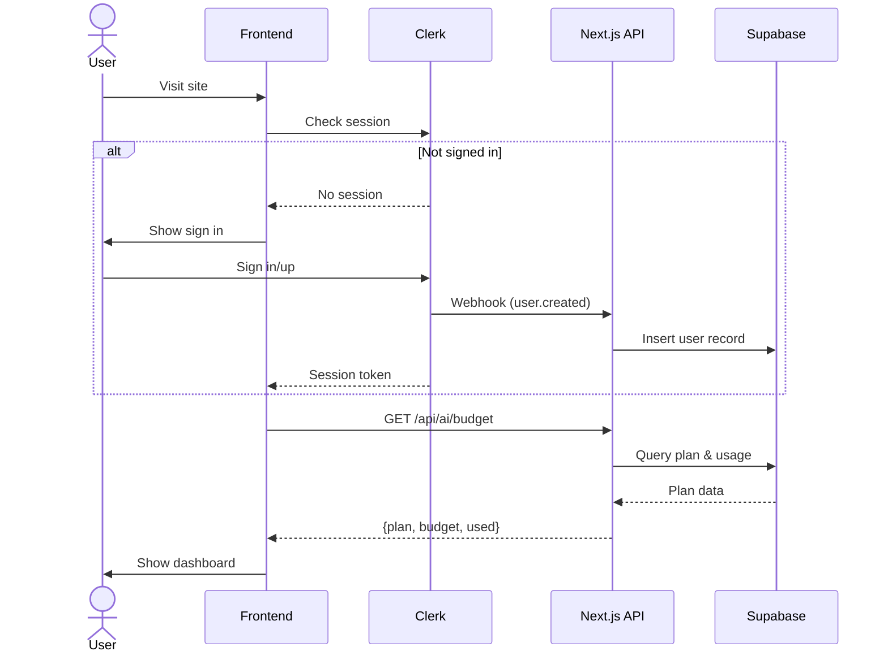
```mermaid
sequenceDiagram
    actor User
    participant UI as Frontend
    participant Clerk
    participant API as Next.js API
    participant DB as Supabase

    User->>UI: Visit site
    UI->>Clerk: Check session
    alt Not signed in
        Clerk-->>UI: No session
        UI->>User: Show sign in
        User->>Clerk: Sign in/up
        Clerk->>API: Webhook (user.created)
        API->>DB: Insert user record
        Clerk-->>UI: Session token
    end
    UI->>API: GET /api/ai/budget
    API->>DB: Query plan & usage
    DB-->>API: Plan data
    API-->>UI: {plan, budget, used}
    UI->>User: Show dashboard
```

### Chat Flow
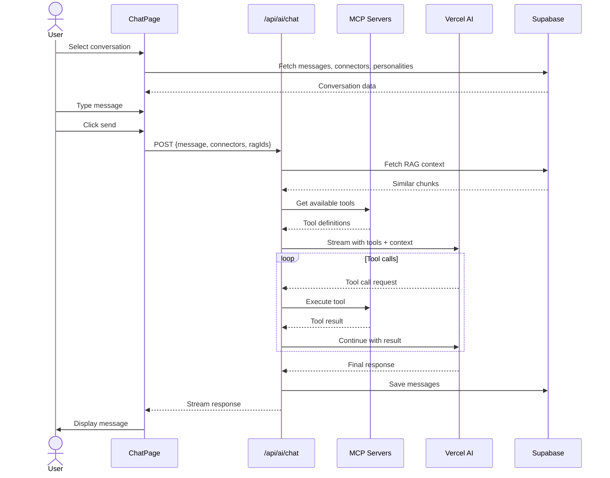
```mermaid
sequenceDiagram
    actor User
    participant UI as ChatPage
    participant API as /api/ai/chat
    participant MCP as MCP Servers
    participant AI as Vercel AI
    participant DB as Supabase

    User->>UI: Select conversation
    UI->>DB: Fetch messages, connectors, personalities
    DB-->>UI: Conversation data
    User->>UI: Type message
    User->>UI: Click send
    UI->>API: POST {message, connectors, ragIds}
    API->>DB: Fetch RAG context
    DB-->>API: Similar chunks
    API->>MCP: Get available tools
    MCP-->>API: Tool definitions
    API->>AI: Stream with tools + context
    loop Tool calls
        AI-->>API: Tool call request
        API->>MCP: Execute tool
        MCP-->>API: Tool result
        API->>AI: Continue with result
    end
    AI-->>API: Final response
    API->>DB: Save messages
    API-->>UI: Stream response
    UI->>User: Display message
```

### Automation Builder Flow
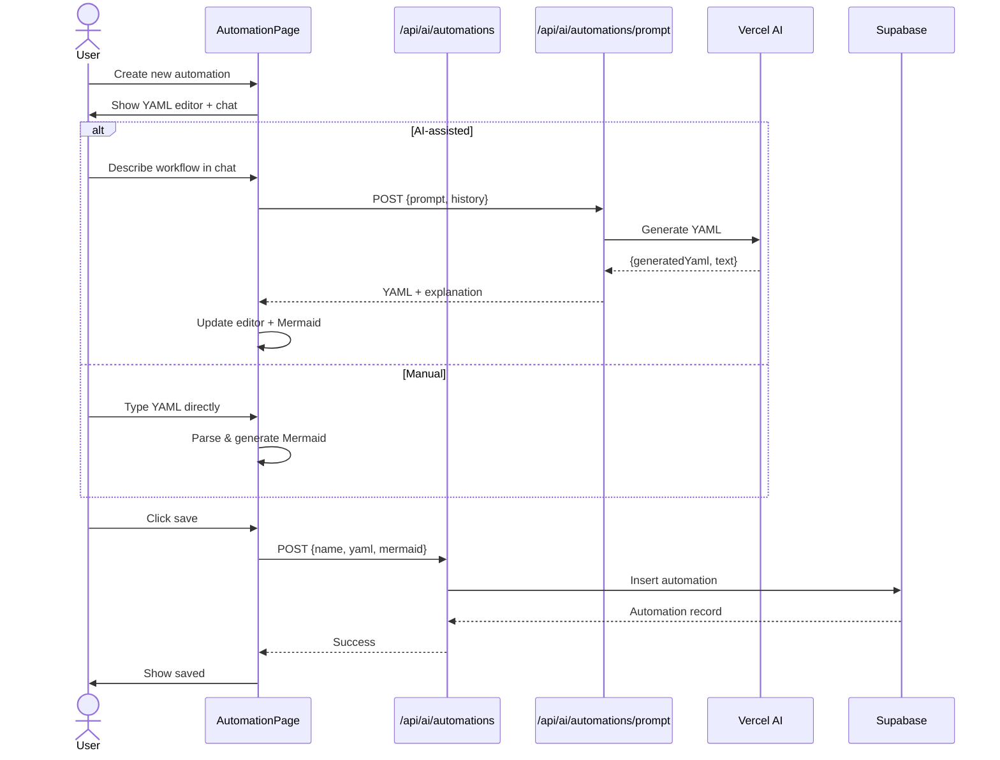
```mermaid
sequenceDiagram
    actor User
    participant UI as AutomationPage
    participant API as /api/ai/automations
    participant Prompt as /api/ai/automations/prompt
    participant AI as Vercel AI
    participant DB as Supabase

    User->>UI: Create new automation
    UI->>User: Show YAML editor + chat
    alt AI-assisted
        User->>UI: Describe workflow in chat
        UI->>Prompt: POST {prompt, history}
        Prompt->>AI: Generate YAML
        AI-->>Prompt: {generatedYaml, text}
        Prompt-->>UI: YAML + explanation
        UI->>UI: Update editor + Mermaid
    else Manual
        User->>UI: Type YAML directly
        UI->>UI: Parse & generate Mermaid
    end
    User->>UI: Click save
    UI->>API: POST {name, yaml, mermaid}
    API->>DB: Insert automation
    DB-->>API: Automation record
    API-->>UI: Success
    UI->>User: Show saved
```

### Automation Execution Flow
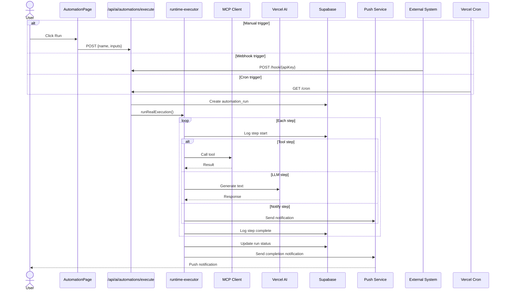
```mermaid
sequenceDiagram
    actor User
    participant UI as AutomationPage
    participant API as /api/ai/automations/execute
    participant Exec as runtime-executor
    participant MCP as MCP Client
    participant AI as Vercel AI
    participant DB as Supabase
    participant Push as Push Service

    alt Manual trigger
        User->>UI: Click Run
        UI->>API: POST {name, inputs}
    else Webhook trigger
        participant Ext as External System
        Ext->>API: POST /hook/{apiKey}
    else Cron trigger
        participant Cron as Vercel Cron
        Cron->>API: GET /cron
    end
    API->>DB: Create automation_run
    API->>Exec: runRealExecution()
    loop Each step
        Exec->>DB: Log step start
        alt Tool step
            Exec->>MCP: Call tool
            MCP-->>Exec: Result
        else LLM step
            Exec->>AI: Generate text
            AI-->>Exec: Response
        else Notify step
            Exec->>Push: Send notification
        end
        Exec->>DB: Log step complete
    end
    Exec->>DB: Update run status
    Exec->>Push: Send completion notification
    Push-->>User: Push notification
```

### OAuth Recovery Flow
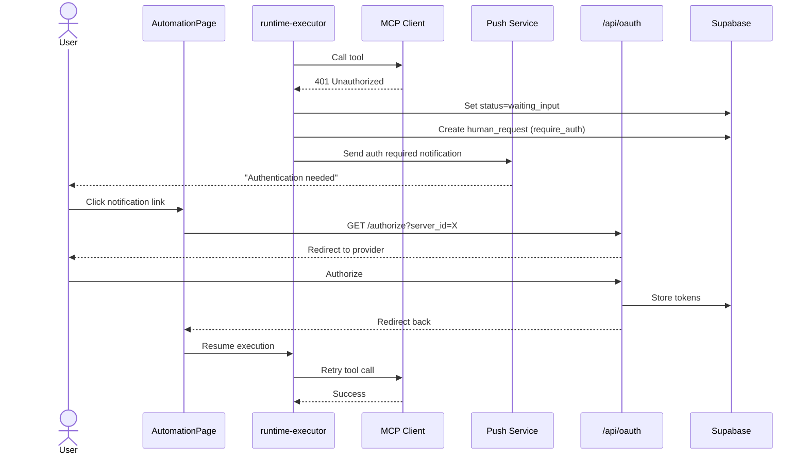
```mermaid
sequenceDiagram
    actor User
    participant UI as AutomationPage
    participant Exec as runtime-executor
    participant MCP as MCP Client
    participant Push as Push Service
    participant OAuth as /api/oauth
    participant DB as Supabase

    Exec->>MCP: Call tool
    MCP-->>Exec: 401 Unauthorized
    Exec->>DB: Set status=waiting_input
    Exec->>DB: Create human_request (require_auth)
    Exec->>Push: Send auth required notification
    Push-->>User: "Authentication needed"
    User->>UI: Click notification link
    UI->>OAuth: GET /authorize?server_id=X
    OAuth-->>User: Redirect to provider
    User->>OAuth: Authorize
    OAuth->>DB: Store tokens
    OAuth-->>UI: Redirect back
    UI->>Exec: Resume execution
    Exec->>MCP: Retry tool call
    MCP-->>Exec: Success
```

### External Surface OAuth Flow
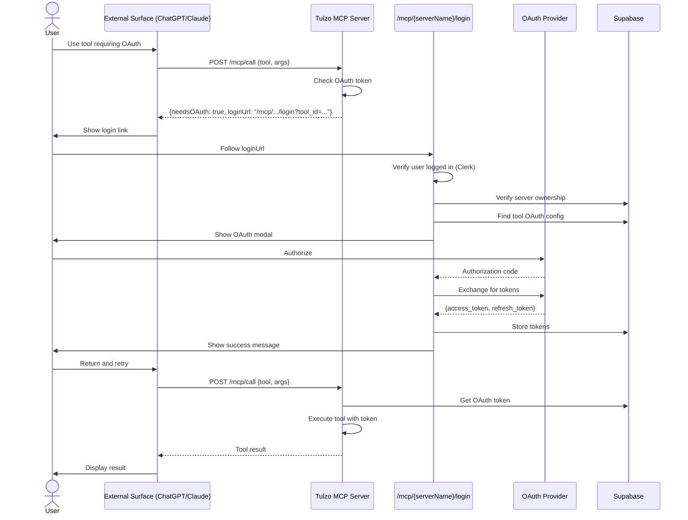
```mermaid
sequenceDiagram
    actor User
    participant Surface as External Surface (ChatGPT/Claude)
    participant MCP as Tulzo MCP Server
    participant Page as /mcp/{serverName}/login
    participant OAuth as OAuth Provider
    participant DB as Supabase

    User->>Surface: Use tool requiring OAuth
    Surface->>MCP: POST /mcp/call {tool, args}
    MCP->>MCP: Check OAuth token
    MCP-->>Surface: {needsOAuth: true, loginUrl: "/mcp/.../login?tool_id=..."}
    Surface->>User: Show login link
    User->>Page: Follow loginUrl
    Page->>Page: Verify user logged in (Clerk)
    Page->>DB: Verify server ownership
    Page->>DB: Find tool OAuth config
    Page->>User: Show OAuth modal
    User->>OAuth: Authorize
    OAuth-->>Page: Authorization code
    Page->>OAuth: Exchange for tokens
    OAuth-->>Page: {access_token, refresh_token}
    Page->>DB: Store tokens
    Page->>User: Show success message
    User->>Surface: Return and retry
    Surface->>MCP: POST /mcp/call {tool, args}
    MCP->>DB: Get OAuth token
    MCP->>MCP: Execute tool with token
    MCP-->>Surface: Tool result
    Surface->>User: Display result
```

### MCP Server Setup Flow
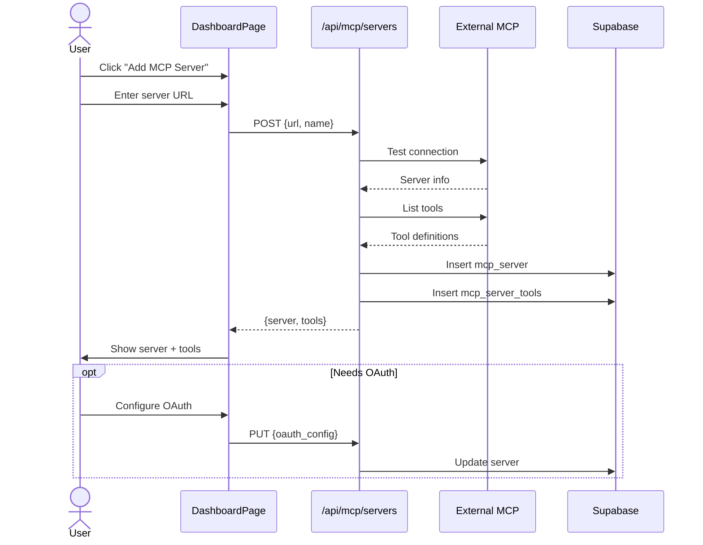
```mermaid
sequenceDiagram
    actor User
    participant UI as DashboardPage
    participant API as /api/mcp/servers
    participant MCP as External MCP
    participant DB as Supabase

    User->>UI: Click "Add MCP Server"
    User->>UI: Enter server URL
    UI->>API: POST {url, name}
    API->>MCP: Test connection
    MCP-->>API: Server info
    API->>MCP: List tools
    MCP-->>API: Tool definitions
    API->>DB: Insert mcp_server
    API->>DB: Insert mcp_server_tools
    API-->>UI: {server, tools}
    UI->>User: Show server + tools
    opt Needs OAuth
        User->>UI: Configure OAuth
        UI->>API: PUT {oauth_config}
        API->>DB: Update server
    end
```

### RAG Knowledge Base Flow
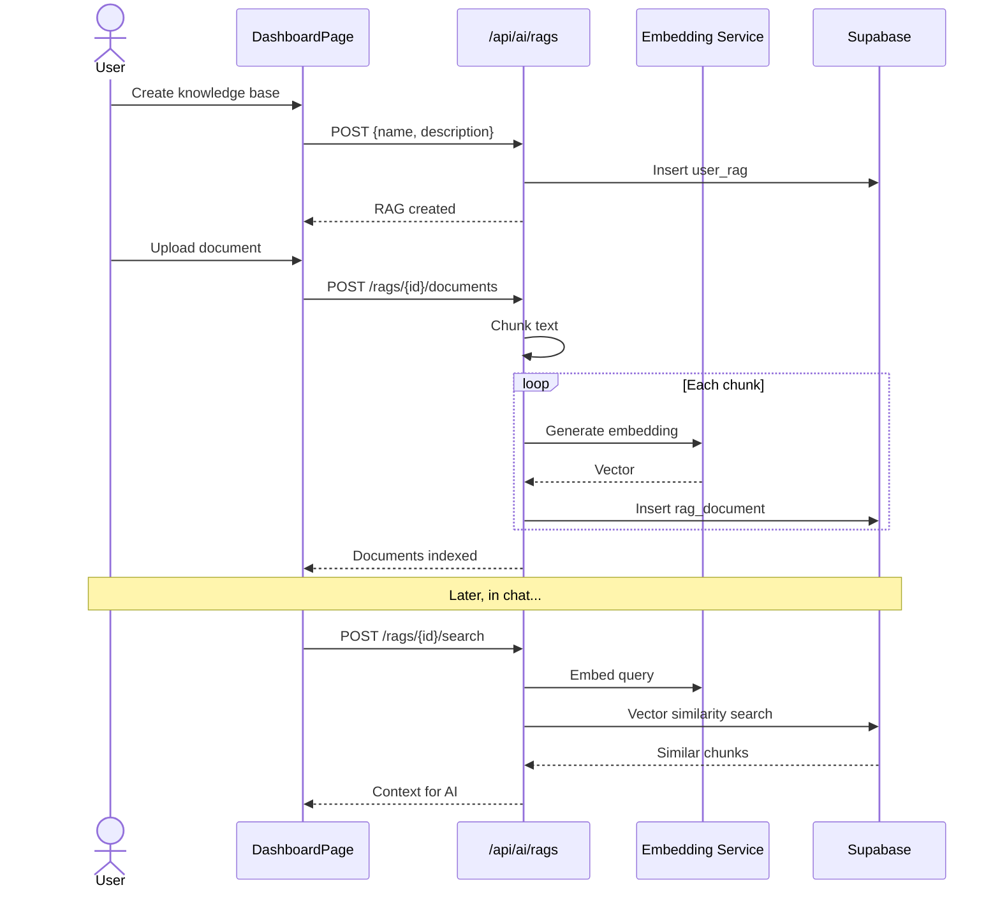
```mermaid
sequenceDiagram
    actor User
    participant UI as DashboardPage
    participant API as /api/ai/rags
    participant Embed as Embedding Service
    participant DB as Supabase

    User->>UI: Create knowledge base
    UI->>API: POST {name, description}
    API->>DB: Insert user_rag
    API-->>UI: RAG created
    User->>UI: Upload document
    UI->>API: POST /rags/{id}/documents
    API->>API: Chunk text
    loop Each chunk
        API->>Embed: Generate embedding
        Embed-->>API: Vector
        API->>DB: Insert rag_document
    end
    API-->>UI: Documents indexed
    Note over User,DB: Later, in chat...
    UI->>API: POST /rags/{id}/search
    API->>Embed: Embed query
    API->>DB: Vector similarity search
    DB-->>API: Similar chunks
    API-->>UI: Context for AI
```

### Push Notification Flow
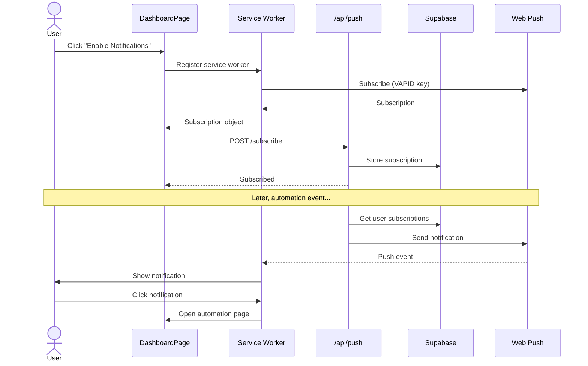
```mermaid
sequenceDiagram
    actor User
    participant UI as DashboardPage
    participant SW as Service Worker
    participant API as /api/push
    participant DB as Supabase
    participant Push as Web Push

    User->>UI: Click "Enable Notifications"
    UI->>SW: Register service worker
    SW->>Push: Subscribe (VAPID key)
    Push-->>SW: Subscription
    SW-->>UI: Subscription object
    UI->>API: POST /subscribe
    API->>DB: Store subscription
    API-->>UI: Subscribed
    Note over User,Push: Later, automation event...
    API->>DB: Get user subscriptions
    API->>Push: Send notification
    Push-->>SW: Push event
    SW->>User: Show notification
    User->>SW: Click notification
    SW->>UI: Open automation page
```

### API Key Management Flow
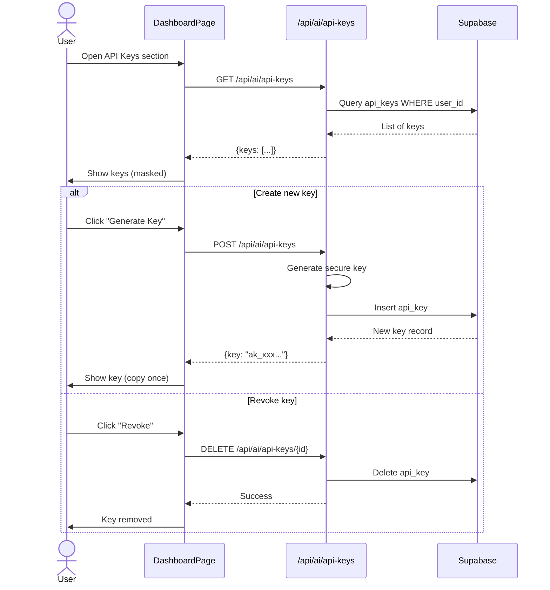
```mermaid
sequenceDiagram
    actor User
    participant UI as DashboardPage
    participant API as /api/ai/api-keys
    participant DB as Supabase

    User->>UI: Open API Keys section
    UI->>API: GET /api/ai/api-keys
    API->>DB: Query api_keys WHERE user_id
    DB-->>API: List of keys
    API-->>UI: {keys: [...]}
    UI->>User: Show keys (masked)
    alt Create new key
        User->>UI: Click "Generate Key"
        UI->>API: POST /api/ai/api-keys
        API->>API: Generate secure key
        API->>DB: Insert api_key
        DB-->>API: New key record
        API-->>UI: {key: "ak_xxx..."}
        UI->>User: Show key (copy once)
    else Revoke key
        User->>UI: Click "Revoke"
        UI->>API: DELETE /api/ai/api-keys/{id}
        API->>DB: Delete api_key
        API-->>UI: Success
        UI->>User: Key removed
    end
```

### Personality/Persona Creation Flow
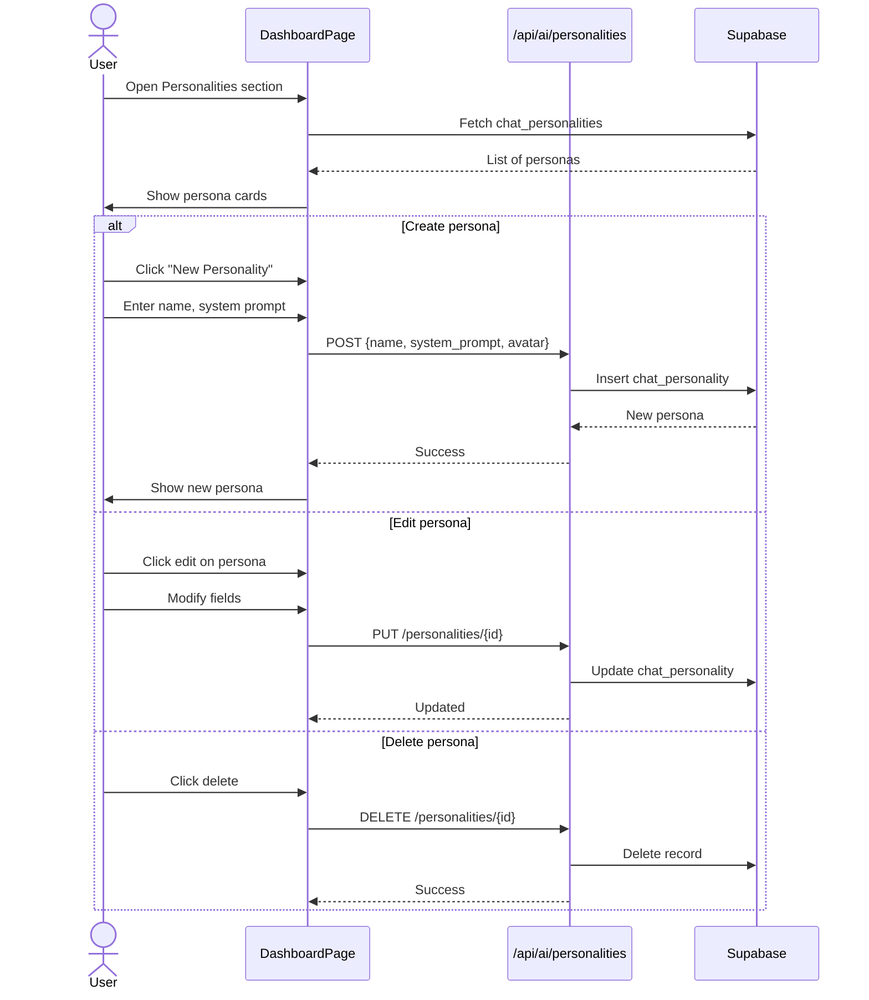
```mermaid
sequenceDiagram
    actor User
    participant UI as DashboardPage
    participant API as /api/ai/personalities
    participant DB as Supabase

    User->>UI: Open Personalities section
    UI->>DB: Fetch chat_personalities
    DB-->>UI: List of personas
    UI->>User: Show persona cards
    alt Create persona
        User->>UI: Click "New Personality"
        User->>UI: Enter name, system prompt
        UI->>API: POST {name, system_prompt, avatar}
        API->>DB: Insert chat_personality
        DB-->>API: New persona
        API-->>UI: Success
        UI->>User: Show new persona
    else Edit persona
        User->>UI: Click edit on persona
        User->>UI: Modify fields
        UI->>API: PUT /personalities/{id}
        API->>DB: Update chat_personality
        API-->>UI: Updated
    else Delete persona
        User->>UI: Click delete
        UI->>API: DELETE /personalities/{id}
        API->>DB: Delete record
        API-->>UI: Success
    end
```

### MCP Server with OAuth Config Flow
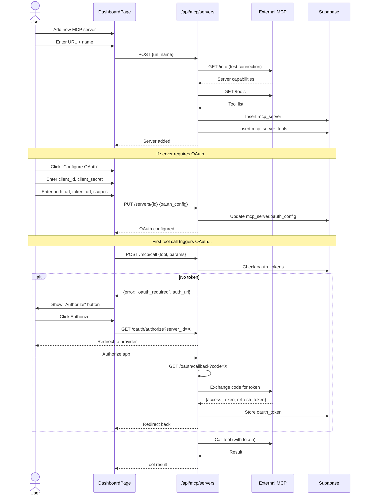
```mermaid
sequenceDiagram
    actor User
    participant UI as DashboardPage
    participant API as /api/mcp/servers
    participant MCP as External MCP
    participant DB as Supabase

    User->>UI: Add new MCP server
    User->>UI: Enter URL + name
    UI->>API: POST {url, name}
    API->>MCP: GET /info (test connection)
    MCP-->>API: Server capabilities
    API->>MCP: GET /tools
    MCP-->>API: Tool list
    API->>DB: Insert mcp_server
    API->>DB: Insert mcp_server_tools
    API-->>UI: Server added
    Note over User,DB: If server requires OAuth...
    User->>UI: Click "Configure OAuth"
    User->>UI: Enter client_id, client_secret
    User->>UI: Enter auth_url, token_url, scopes
    UI->>API: PUT /servers/{id} {oauth_config}
    API->>DB: Update mcp_server.oauth_config
    API-->>UI: OAuth configured
    Note over User,DB: First tool call triggers OAuth...
    UI->>API: POST /mcp/call {tool, params}
    API->>DB: Check oauth_tokens
    alt No token
        API-->>UI: {error: "oauth_required", auth_url}
        UI->>User: Show "Authorize" button
        User->>UI: Click Authorize
        UI->>API: GET /oauth/authorize?server_id=X
        API-->>User: Redirect to provider
        User->>API: Authorize app
        API->>API: GET /oauth/callback?code=X
        API->>MCP: Exchange code for token
        MCP-->>API: {access_token, refresh_token}
        API->>DB: Store oauth_token
        API-->>UI: Redirect back
    end
    API->>MCP: Call tool (with token)
    MCP-->>API: Result
    API-->>UI: Tool result
```

### REST API Spec Import Flow
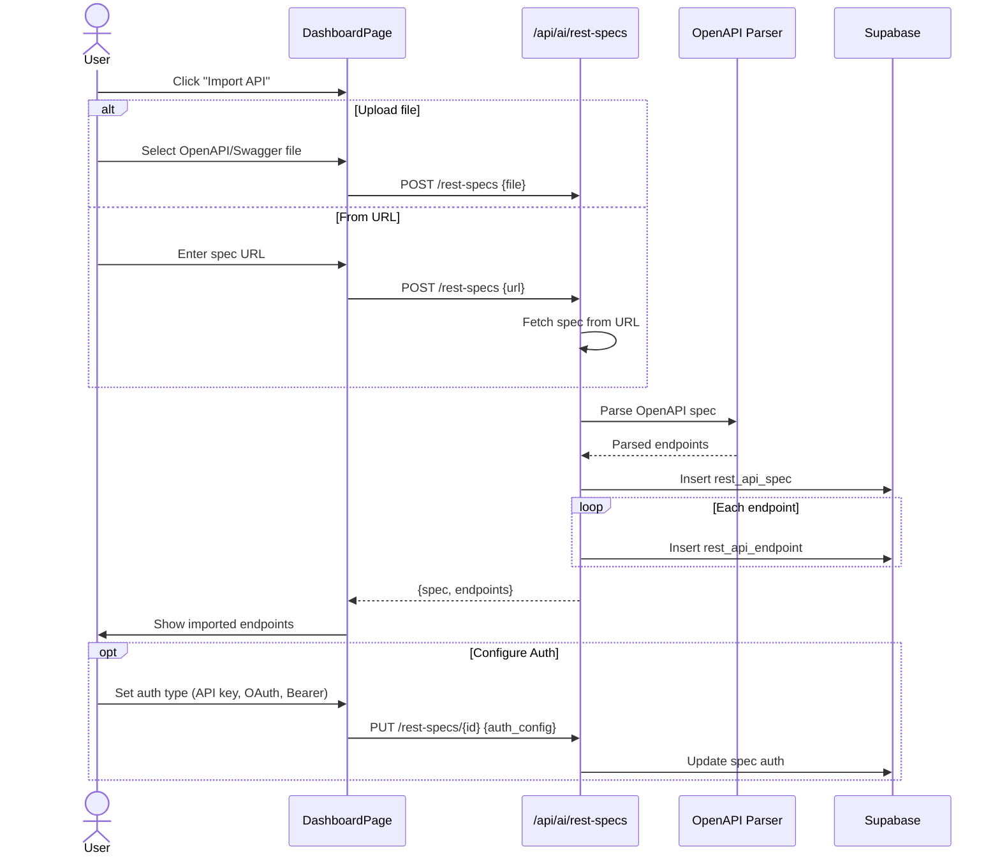
```mermaid
sequenceDiagram
    actor User
    participant UI as DashboardPage
    participant API as /api/ai/rest-specs
    participant Parser as OpenAPI Parser
    participant DB as Supabase

    User->>UI: Click "Import API"
    alt Upload file
        User->>UI: Select OpenAPI/Swagger file
        UI->>API: POST /rest-specs {file}
    else From URL
        User->>UI: Enter spec URL
        UI->>API: POST /rest-specs {url}
        API->>API: Fetch spec from URL
    end
    API->>Parser: Parse OpenAPI spec
    Parser-->>API: Parsed endpoints
    API->>DB: Insert rest_api_spec
    loop Each endpoint
        API->>DB: Insert rest_api_endpoint
    end
    API-->>UI: {spec, endpoints}
    UI->>User: Show imported endpoints
    opt Configure Auth
        User->>UI: Set auth type (API key, OAuth, Bearer)
        UI->>API: PUT /rest-specs/{id} {auth_config}
        API->>DB: Update spec auth
    end
```

### MCP Composer Flow (Import Sources)
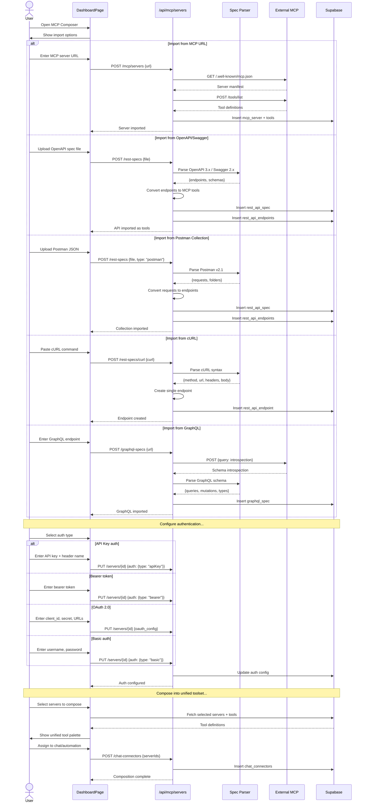
```mermaid
sequenceDiagram
    actor User
    participant UI as DashboardPage
    participant API as /api/mcp/servers
    participant Parser as Spec Parser
    participant MCP as External MCP
    participant DB as Supabase

    User->>UI: Open MCP Composer
    UI->>User: Show import options

    alt Import from MCP URL
        User->>UI: Enter MCP server URL
        UI->>API: POST /mcp/servers {url}
        API->>MCP: GET /.well-known/mcp.json
        MCP-->>API: Server manifest
        API->>MCP: POST /tools/list
        MCP-->>API: Tool definitions
        API->>DB: Insert mcp_server + tools
        API-->>UI: Server imported

    else Import from OpenAPI/Swagger
        User->>UI: Upload OpenAPI spec file
        UI->>API: POST /rest-specs {file}
        API->>Parser: Parse OpenAPI 3.x / Swagger 2.x
        Parser-->>API: {endpoints, schemas}
        API->>API: Convert endpoints to MCP tools
        API->>DB: Insert rest_api_spec
        API->>DB: Insert rest_api_endpoints
        API-->>UI: API imported as tools

    else Import from Postman Collection
        User->>UI: Upload Postman JSON
        UI->>API: POST /rest-specs {file, type: "postman"}
        API->>Parser: Parse Postman v2.1
        Parser-->>API: {requests, folders}
        API->>API: Convert requests to endpoints
        API->>DB: Insert rest_api_spec
        API->>DB: Insert rest_api_endpoints
        API-->>UI: Collection imported

    else Import from cURL
        User->>UI: Paste cURL command
        UI->>API: POST /rest-specs/curl {curl}
        API->>Parser: Parse cURL syntax
        Parser-->>API: {method, url, headers, body}
        API->>API: Create single endpoint
        API->>DB: Insert rest_api_endpoint
        API-->>UI: Endpoint created

    else Import from GraphQL
        User->>UI: Enter GraphQL endpoint
        UI->>API: POST /graphql-specs {url}
        API->>MCP: POST {query: introspection}
        MCP-->>API: Schema introspection
        API->>Parser: Parse GraphQL schema
        Parser-->>API: {queries, mutations, types}
        API->>DB: Insert graphql_spec
        API-->>UI: GraphQL imported
    end

    Note over User,DB: Configure authentication...
    User->>UI: Select auth type
    alt API Key auth
        User->>UI: Enter API key + header name
        UI->>API: PUT /servers/{id} {auth: {type: "apiKey"}}
    else Bearer token
        User->>UI: Enter bearer token
        UI->>API: PUT /servers/{id} {auth: {type: "bearer"}}
    else OAuth 2.0
        User->>UI: Enter client_id, secret, URLs
        UI->>API: PUT /servers/{id} {oauth_config}
    else Basic auth
        User->>UI: Enter username, password
        UI->>API: PUT /servers/{id} {auth: {type: "basic"}}
    end
    API->>DB: Update auth config
    API-->>UI: Auth configured

    Note over User,DB: Compose into unified toolset...
    User->>UI: Select servers to compose
    UI->>DB: Fetch selected servers + tools
    DB-->>UI: Tool definitions
    UI->>User: Show unified tool palette
    User->>UI: Assign to chat/automation
    UI->>API: POST /chat-connectors {serverIds}
    API->>DB: Insert chat_connectors
    API-->>UI: Composition complete
```

### Chat Connector Composition Flow
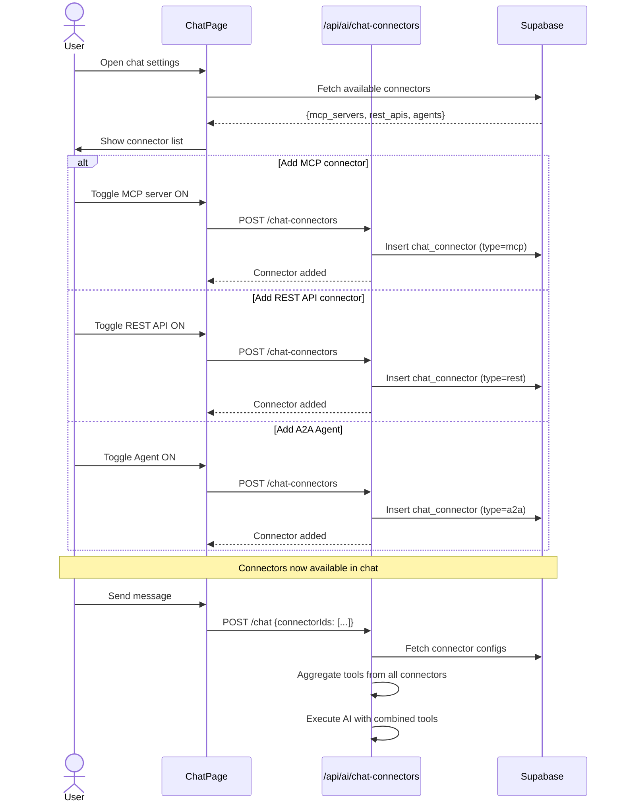
```mermaid
sequenceDiagram
    actor User
    participant UI as ChatPage
    participant API as /api/ai/chat-connectors
    participant DB as Supabase

    User->>UI: Open chat settings
    UI->>DB: Fetch available connectors
    DB-->>UI: {mcp_servers, rest_apis, agents}
    UI->>User: Show connector list
    alt Add MCP connector
        User->>UI: Toggle MCP server ON
        UI->>API: POST /chat-connectors
        API->>DB: Insert chat_connector (type=mcp)
        API-->>UI: Connector added
    else Add REST API connector
        User->>UI: Toggle REST API ON
        UI->>API: POST /chat-connectors
        API->>DB: Insert chat_connector (type=rest)
        API-->>UI: Connector added
    else Add A2A Agent
        User->>UI: Toggle Agent ON
        UI->>API: POST /chat-connectors
        API->>DB: Insert chat_connector (type=a2a)
        API-->>UI: Connector added
    end
    Note over User,DB: Connectors now available in chat
    User->>UI: Send message
    UI->>API: POST /chat {connectorIds: [...]}
    API->>DB: Fetch connector configs
    API->>API: Aggregate tools from all connectors
    API->>API: Execute AI with combined tools
```

### Conversation Management Flow
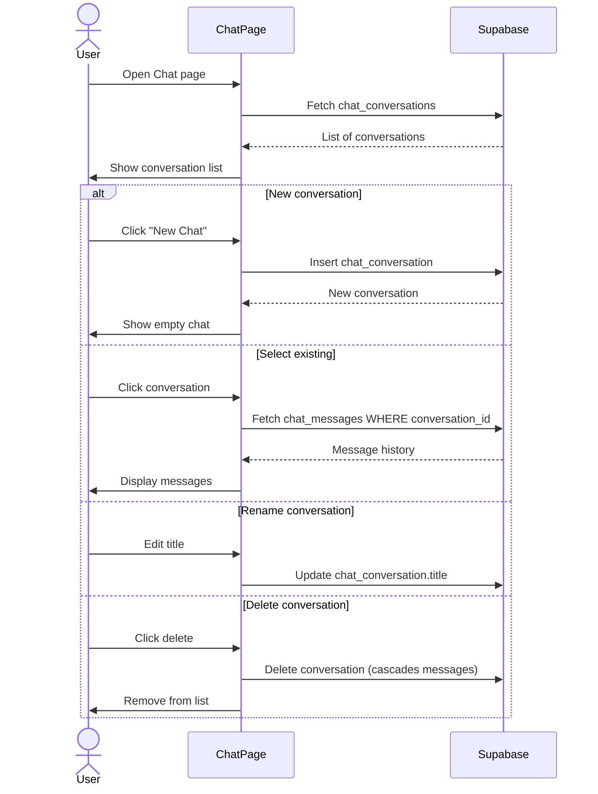
```mermaid
sequenceDiagram
    actor User
    participant UI as ChatPage
    participant DB as Supabase

    User->>UI: Open Chat page
    UI->>DB: Fetch chat_conversations
    DB-->>UI: List of conversations
    UI->>User: Show conversation list
    alt New conversation
        User->>UI: Click "New Chat"
        UI->>DB: Insert chat_conversation
        DB-->>UI: New conversation
        UI->>User: Show empty chat
    else Select existing
        User->>UI: Click conversation
        UI->>DB: Fetch chat_messages WHERE conversation_id
        DB-->>UI: Message history
        UI->>User: Display messages
    else Rename conversation
        User->>UI: Edit title
        UI->>DB: Update chat_conversation.title
    else Delete conversation
        User->>UI: Click delete
        UI->>DB: Delete conversation (cascades messages)
        UI->>User: Remove from list
    end
```

### Plan Upgrade Flow
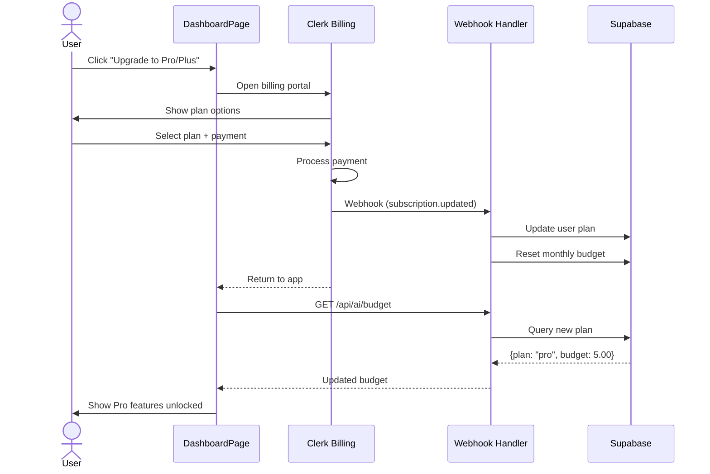
```mermaid
sequenceDiagram
    actor User
    participant UI as DashboardPage
    participant Clerk as Clerk Billing
    participant API as Webhook Handler
    participant DB as Supabase

    User->>UI: Click "Upgrade to Pro/Plus"
    UI->>Clerk: Open billing portal
    Clerk->>User: Show plan options
    User->>Clerk: Select plan + payment
    Clerk->>Clerk: Process payment
    Clerk->>API: Webhook (subscription.updated)
    API->>DB: Update user plan
    API->>DB: Reset monthly budget
    Clerk-->>UI: Return to app
    UI->>API: GET /api/ai/budget
    API->>DB: Query new plan
    DB-->>API: {plan: "pro", budget: 5.00}
    API-->>UI: Updated budget
    UI->>User: Show Pro features unlocked
```

### Automation Scheduling Flow
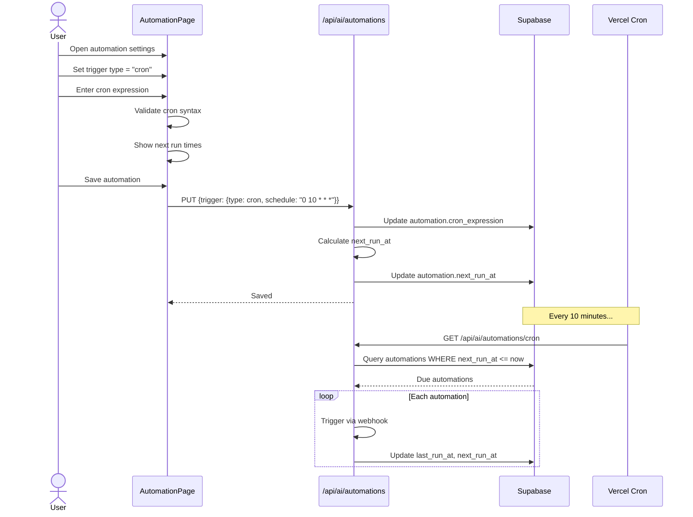
```mermaid
sequenceDiagram
    actor User
    participant UI as AutomationPage
    participant API as /api/ai/automations
    participant DB as Supabase
    participant Cron as Vercel Cron

    User->>UI: Open automation settings
    User->>UI: Set trigger type = "cron"
    User->>UI: Enter cron expression
    UI->>UI: Validate cron syntax
    UI->>UI: Show next run times
    User->>UI: Save automation
    UI->>API: PUT {trigger: {type: cron, schedule: "0 10 * * *"}}
    API->>DB: Update automation.cron_expression
    API->>API: Calculate next_run_at
    API->>DB: Update automation.next_run_at
    API-->>UI: Saved
    Note over Cron,DB: Every 10 minutes...
    Cron->>API: GET /api/ai/automations/cron
    API->>DB: Query automations WHERE next_run_at <= now
    DB-->>API: Due automations
    loop Each automation
        API->>API: Trigger via webhook
        API->>DB: Update last_run_at, next_run_at
    end
```

## Coding Standards

### TypeScript Conventions

```typescript
// Use explicit types, avoid 'any'
interface AutomationRun {
  id: string;
  status: 'pending' | 'running' | 'completed' | 'failed' | 'waiting_input';
  // ...
}

// Use async/await, not .then()
async function fetchData() {
  const result = await supabase.from('table').select('*');
  return result.data;
}

// Destructure props
function Component({ isPro, isPlus }: Props) { ... }
```

### File Organization

- **API Routes**: One route per file, export named handlers (`GET`, `POST`, etc.)
- **Views**: Large page components in `src/views/`, imported by `app/` pages
- **Types**: Shared types in `src/types/supabase.ts`
- **Config**: Centralized config in `src/config/`

### Error Handling

```typescript
// API routes: Return JSON with error
if (!user) {
  return NextResponse.json({ error: 'Unauthorized' }, { status: 401 });
}

// Throw custom errors for specific handling
throw new OAuthRequiredError(serverId, serverName);
```

### Database Access

```typescript
// Always use service role for server-side
import { createClient } from '@supabase/supabase-js';
const supabase = createClient(
  process.env.NEXT_PUBLIC_SUPABASE_URL!,
  process.env.SUPABASE_SERVICE_ROLE_KEY!
);

// Filter by user_id for RLS bypass
const { data } = await supabase
  .from('automations')
  .select('*')
  .eq('user_id', userId);
```

## Project Mindmap

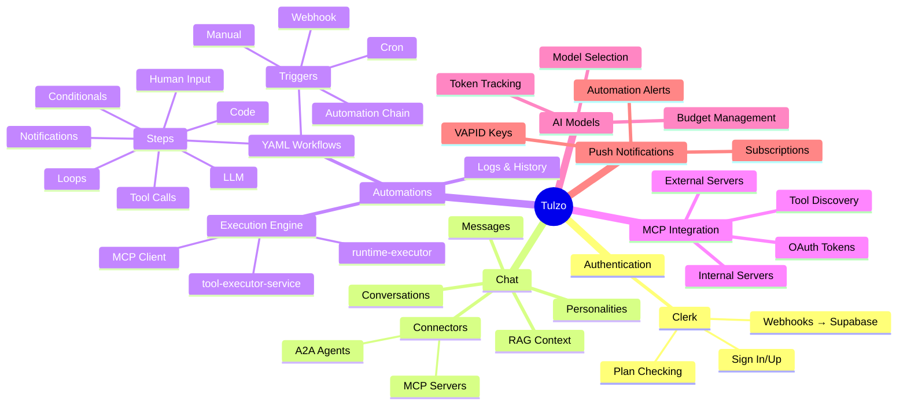
```mermaid
mindmap
  root((Tulzo))
    Authentication
      Clerk
        Sign In/Up
        Plan Checking
        Webhooks → Supabase
    Chat
      Conversations
      Messages
      Connectors
        MCP Servers
        A2A Agents
      Personalities
      RAG Context
    Automations
      YAML Workflows
        Steps
          Tool Calls
          LLM
          Code
          Conditionals
          Loops
          Human Input
          Notifications
        Triggers
          Manual
          Webhook
          Cron
          Automation Chain
      Execution Engine
        runtime-executor
        tool-executor-service
        MCP Client
      Logs & History
    MCP Integration
      Internal Servers
      External Servers
      OAuth Tokens
      Tool Discovery
    AI Models
      Token Tracking
      Budget Management
      Model Selection
    Push Notifications
      VAPID Keys
      Subscriptions
      Automation Alerts
```

## Test Plan (UI-Driven with Cypress)

### Recording Approach

1. Use Chrome DevTools Recorder or Cypress Studio
2. Record user interactions for each flow
3. Export as Cypress tests
4. Add assertions for expected outcomes

### Test Scenarios

#### 1. Authentication Flow
```
- [ ] Sign up with email
- [ ] Sign in with email
- [ ] Sign out
- [ ] Plan upgrade flow (free → pro → plus)
- [ ] Verify plan-gated features
```

#### 2. Chat Flow
```
- [ ] Create new conversation
- [ ] Send message and receive response
- [ ] Add/remove MCP connector
- [ ] Add/remove personality
- [ ] Attach RAG knowledge base
- [ ] Verify token usage tracking
```

#### 3. Automation Builder
```
- [ ] Create new automation
- [ ] Edit YAML manually
- [ ] Use AI to generate YAML from description
- [ ] View Mermaid diagram
- [ ] Save automation
- [ ] Delete automation
```

#### 4. Automation Execution
```
- [ ] Manual run (no inputs)
- [ ] Manual run (with required inputs)
- [ ] View execution logs
- [ ] View execution history
- [ ] Stop running execution
- [ ] Delete execution
```

#### 5. Webhook Triggers
```
- [ ] Copy webhook URL
- [ ] Trigger via cURL
- [ ] Verify execution starts
- [ ] Verify payload passed to workflow
```

#### 6. MCP Server Management
```
- [ ] Add MCP server
- [ ] Test connection
- [ ] View available tools
- [ ] Configure OAuth
- [ ] Delete MCP server
```

#### 7. RAG Knowledge Bases
```
- [ ] Create knowledge base
- [ ] Upload document
- [ ] Search knowledge base
- [ ] Attach to chat
- [ ] Delete knowledge base
```

#### 8. Push Notifications
```
- [ ] Enable notifications
- [ ] Receive automation alert
- [ ] Click notification to view
- [ ] Disable notifications
```

#### 9. OAuth Flow
```
- [ ] Trigger tool requiring auth
- [ ] Complete OAuth flow
- [ ] Verify token stored
- [ ] Verify tool works after auth
```

### Cypress Configuration

```javascript
// cypress.config.js
module.exports = {
  e2e: {
    baseUrl: 'http://localhost:3000',
    supportFile: 'cypress/support/e2e.js',
    specPattern: 'cypress/e2e/**/*.cy.{js,ts}',
    viewportWidth: 1280,
    viewportHeight: 720,
  },
};
```

### Example Test Structure

```typescript
// cypress/e2e/automation.cy.ts
describe('Automation Builder', () => {
  beforeEach(() => {
    cy.login(); // Custom command for Clerk auth
    cy.visit('/automation');
  });

  it('creates automation from AI prompt', () => {
    cy.get('[data-testid="new-automation"]').click();
    cy.get('[data-testid="ai-prompt"]').type('Create a workflow that...');
    cy.get('[data-testid="generate"]').click();
    cy.get('[data-testid="yaml-editor"]').should('contain', 'name:');
    cy.get('[data-testid="save"]').click();
    cy.get('[data-testid="success-toast"]').should('be.visible');
  });
});
```

